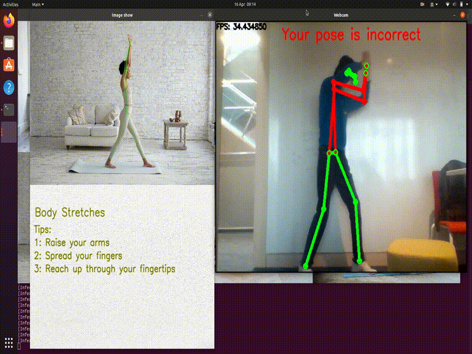

# myYogaMate
<br/>
<p align="center">

  </p>
<br/>

<h2 id="status">Status</h2>
<p><a href="LICENSE"></a>

<a href="https://github.com/SunitaAcharya/myYogaMate/issues"></a> 
<a href="https://github.com/SunitaAcharya/myYogaMate/pulls"></a>  

</p>

### Table of contents


* [About the project](#about-the-project)
* [Requirements](#requirements)
* [Guide](#guide)
* [Code Structure](#code-structure)
* [License](#license)
* [Authors](#authors)
* [Social Media](#social-media)
* [References](#references)

### About the Project
My Yoga Mate - MYM , is a project built by postgraduate students of University of Glasgow. MYM detects human posture doing yoga and compares it with the stored original image and state the user whether the pose is correct or not. We have build this project in C++ language and used Tensorflow libaries to find the key points of hunan pose estimation and posture angle. This will be a great use for people who do yoga on a daily basis where they can get a guidance for correct posture of a human doing a particular yoag pose. We can extend our project and make an app for this so that it will be easy and convinient for everyone to use it daily.

<bold>Our Github Page link : https://sunitaacharya.github.io/myYogaMate/ </bold>
### Requirements
Hardware 
* Linux Laptop/ Ubuntu dual setup in Windows Laptop
* Webcam

Software
* Ubuntu(x64)
* C++ API
* Visual Studio(2019)
* OpenCV (4.5.5) and necessary dependencies
* Cmake
* Boost

Install<br/>
```sh
sudo make install
```
To download our source code along with submodule<br/>
```sh
$ git init 
$ git clone git@github.com:SunitaAcharya/myYogaMate.git  
$ cd myYogaMate/
$ git submodule update --init --recursive --remote
```
To download pre-build libararies
```sh
$ cd InferenceHelper/
$ sh third_party/download_prebuilt_libraries.sh
$ cd ..
```
<br/>

To Build<br/>
```sh
mkdir build
cd build
cmake ..
make    #to compile program
./main 
```

### Guide
1. Run the above commands to download our source code and build it
2. Press any key to start the program
3. Select 1, 2, 3, 4, 5, 6 to select image
4. Press "q" to exit
5. Press "," or "." to resize webcam window

### Code Structure
* image_helper.cpp: It includes all the functions that can help the image_processor and image_show to implement their functions. For example, checking the image type, detecting the key presssed by users, resizing output windows, and showing remainder statement.
* image_processor.cpp: Image processor can compare the pose of user with image. It includes the functions of initialisation, angle calculation and comparison, and drawing of joint points and lines.
* image_show.cpp: It focuses on showing the homepage, image window, and camera window at the same time.
* pose_engine.cpp: It sets model information and input parameters for Tensor flow and reture the result from Tensor flow.

<p align="center">

  </p>

image_show() function is used to read and analyse the image choosen from menu. Also, it calculates the angles.
camera_show() function is used to analyse the pose from webcam. It then calculates the angles which will used while comparing the angles of both the images and camera in realtime.

### License
Copyright 2022 UofG_rtep_team4<br/>
Licensed under the MIT License<br/>
Please visit <a href="https://github.com/SunitaAcharya/myYogaMate/blob/main/LICENSE">License </a>  for more details.<br/>

### Authors
 <a href="https://github.com/SunitaAcharya/myYogaMate">Sunita Acharya</a> <br/>
 <a href="https://github.com/YuanZhang2672750">Yuan Zhang</a> <br/>
 <a href="https://github.com/siyu0415">Siyu Liu</a> <br/>
 <a href="https://github.com/qwershu007">Shujun Wang</a> <br/>

### Social Media
 Follow us on : 
<table>
  <tr>
    <td><a href="https://www.facebook.com/MYM-My-Yoga-Mate-111468058198753/"></td>
    <td><a href="https://www.instagram.com/myyogamate_/"></td>
    </tr>
    </table>

### References
<a href="https://linuxconfig.org/how-to-install-ubuntu-20-04-alongside-windows-10-dual-boot">To install Ubuntu on Windows 10 for Dual SetUP </a><br/>
<a href="https://bleedai.com/introduction-to-pose-detection-and-basic-pose-classification/">Human Basic Pose classification </a><br/>
<a href="http://techawarey.com/programming/install-opencv-c-c-in-ubuntu-18-04-lts-step-by-step-guide/">OpenCv installation Guide </a><br/>
<a href="https://github.com/opencv/opencv_contrib">OpenCv  Lib </a> </br>
<a href="https://www.digitalocean.com/community/conceptual_articles/s-o-l-i-d-the-first-five-principles-of-object-oriented-design ">Object Oriented Programming </a><br/> 
<a href="https://www.programiz.com/cpp-programming/memory-management">C++ memory management </a><br/> 
<a href="https://github.com/iwatake2222/InferenceHelper">InferenceHelper </a><br/>
<a href="https://www.mygreatlearning.com/blog/readme-file/">How to use README File </a><br/> 
https://www.youtube.com/watch?v=fiDaAc7z_kQ&list=PLm3gcFKTH-o-GhANAGu93TYwHc6YmVbwE&index=4 <br/>


&copy; 2022 Copyright UofG_Real_Time_Embedded_Systems_Team4
